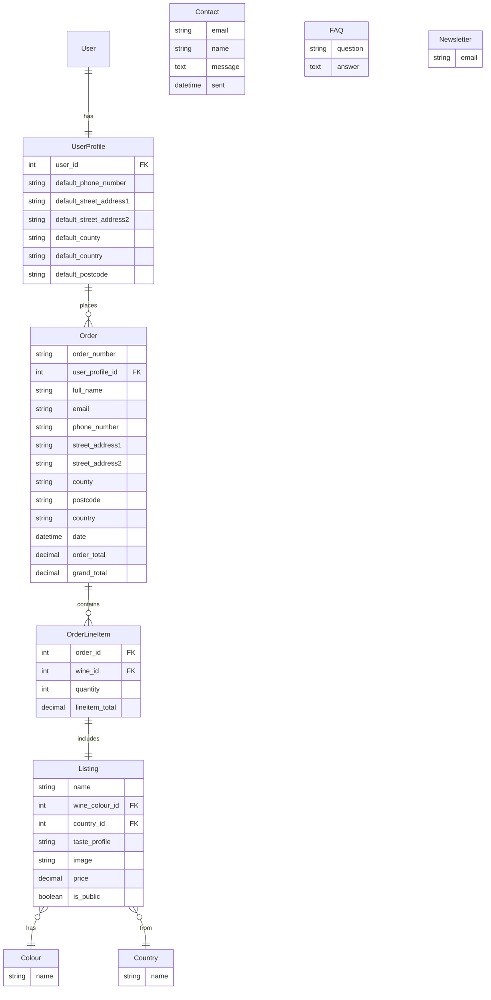

### Mermaid Interactive ERD

I have created an interactive ERD of my project using `Mermaid`.

source: [Mermaid](https://mermaid.live/edit#pako:eNqNVduO2jAQ_ZXIzywKWQhL3latVqq66kVVXyokZJIBrDp21h6LpcC_d3JjQy7s-sk5czyXM2PnyGKdAIsYmM-Cbw1Pl8qj9duC8U6nu7vTqdj_MHojJHiRt-P2jVLDOVMfve8moWORl0keQ0UrsSbhWSj4gpASMdYKuVBN6sVaRX8WFoXaElmoWLqk9lvjZ13QPmmpnWnm1yE4heZAjI3RVGW3iGMJ5Uso9ByZViLxnr6-4RZN7jKBDXcSV9lOK1gpl67BDJLoEwBXPEkMWDv5IC8Y5MV5IYfbZjNsz7TFvOcl4VwLUbbp2Dmmc7xT4kWfrNRuQKeNk3KleAodC6RcyA56U8_3dHxPvwHdrvVo85tCJhwBRQrFpgFDLFIuK6VQI5ddI90slTSN18Jfhr41g6XPlri5YU8H-vAXxxWKZpl1BpJOCArRm0R9V7r9v-7eJXRcXLe-DCrZBiYCuUWop6ZjpUS3PcpmRsQNeK21BK48YVeZW0sRt4qpnoJbtTS45avwQTK9VjH2kPvH-Vo7hFf0UhrN6xrrobKgsBXv6fFnT6wXB9QsrVqeubL7-tZcPHyDvZWA2Hu1G0nTATZiKRiCEvobFOQlwx1QBSyibcLN3yVbqjPxuEP966BiFqFxMGIuy6uo_h8s2nBpCc24YtGRvbJoOnkY-_e-P11M_HkYziYjdiA0HIfBdDGfLR78RTC798PziP3Tmjz444f5zKcVhP587gezwtufwlaGNNptd5dQW5NnXVlA0Z0p-sqiYHH-D9beK_w)

Wine icons created by iconixar - Flaticon