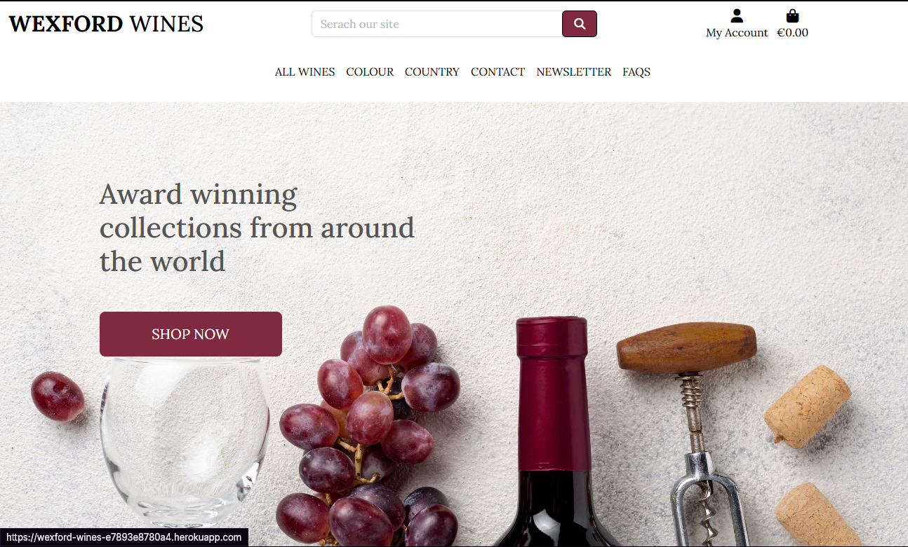

# [wexford-wines](https://wexford-wines-e7893e8780a4.herokuapp.com)

Developer: Nick Wallace ([Nic-Wallace](https://www.github.com/Nic-Wallace))

Wexford Wines is a mock site for the proposed business of the same name based in Wexford, Ireland. The site is streamlined, easy to use and easy on the eyes, as the business appeals to appreciators of high-end wines that are sleek and sophisticated. This site gives the business an extra edge, being able to expand their market and reach more customers online with a fashionable and user-friendly website.

source: [wexford-wines amiresponsive](https://ui.dev/amiresponsive?url=https://wexford-wines-e7893e8780a4.herokuapp.com)

> [!IMPORTANT]
> The examples in these templates are strongly influenced by the Code Institute walkthrough project called "Boutique Ado".

## UX

### The 5 Planes of UX

#### 1. Strategy

**Purpose**
- Provide a sleek and sophisticated site to sell high-end wines.
- Give customers a pleasant and stress-free experience of using the site and making a purchase with ease.
- Enable site owners to efficiently create and manage listings on the store.

**Primary User Needs**
- Guest users need to view and purchase items easily, with the option of creating an account or contacting the business.
- Customers with an account need to be able to manage their account details and view their order history.
- Site owners need to be abble to manage their site content efficiently.

**Business Goals**
- Improve sales be reaching a larger customer base and provide them with a positive user experience to encourage purchase.
- Gain loyal customers by encouraging account creation and interaction with the business via newsletter and contact form.
- Manage the site inventory to keep it up to date.

#### 2. Scope

**[Features](#features)** (see below)

**Content Requirements**
- Wine listing with image, wine name, taste profile, country of origin, wine colour and price.
- A responsive site that gives clear prompts for user actions and confirms these actions.
- Contact form and newsletter sign up.
- Email confirmations, order history, useful redirection.
- FAQ page with useful questions and answers.
- Secure payment processing using Stripe.
- Link to map of location of the business.
- 404 page to notify users that the page they are looking for doesn't exist.

#### 3. Structure

**Information Architecture**
- **Navigation Menu**:
  - Links to Home, All Wines, Colour filter, Country filter, Contact,Newsletter, FAQ, and Account area.
- **Hierarchy**:
  - Clear wine filters for easy navigation.
  - Cart and checkout options clearly displayed to prompt purchase.

**User Flow**
1. Guest user visits the store → filters wine by colour or country.
2. Guest user adds wines to cart → proceeds to checkout.
3. Guest user creates an account or logs in during checkout → completes purchase.
4. Guest user navigates to contact page → fills in form to message the business.
5. Guest user seeks an answer to a question → seeks and finds relevant information on FAQ page.
6. Guest user navigates to newsletter page → signs up and recieves email confirmation.
7. Guest user visits contact page → clicks external link to view location of business.
8. Returning customer logs in → views their order history.
9. Returning customer logs in → can update their delivery details.
10. Site owners manage inventory → add, update, or delete wine listings.

#### 4. Skeleton

**[Wireframes](#wireframes)** (see below)

#### 5. Surface

**Visual Design Elements**
- **[Colours](#colour-scheme)** (see below)
- **[Typography](#typography)** (see below)

### Colour Scheme

I used [coolors.co](https://coolors.co/080708-3772ff-df2935-fdca40-e6e8e6) to generate my color palette.

- `#585858` primary text.
- `#FFFFFF` primary highlights.
- `#000000` secondary text.
- `#7F2A40` secondary highlights.

### Typography

- [Lora](https://fonts.google.com/specimen/Lora) was used for all site text for coherence, the site header was styled for a more eye-catching title.
- [Font Awesome](https://fontawesome.com) icons were used throughout the site, such as the icons in the navigation bar.
- [Favicon.io](https://favicon.io) was used to find the favicon for the site.

## Wireframes

To follow best practice, wireframes were developed for mobile, tablet, and desktop sizes. I sketched the wireframes and uploaded pictures of these:

| Page | Mobile | Tablet | Desktop |
| --- | --- | --- | --- |
| Register |  |  |  |
| Login |  |  |  |
| Profile |  |  |  |
| Homepage |  |  |  |
| Wines |  |  |  |
| Wine Details |  |  |  |
| Cart |  |  |  |
| Checkout |  |  |  |
| Checkout Success |  |  |  |
| Add listing |  |  |  |
| Edit listing |  |  |  |
| Newsletter |  |  |  |
| Contact |  |  |  |
| 404 |  |  |  |
| FAQ |  |  |  |

## User Stories

| Target | Expectation | Outcome |
| --- | --- | --- |

## Features

### Existing Features

| Feature | Notes | Screenshot |
| --- | --- | --- |
| Register | Authentication is handled by allauth, allowing users to register accounts. |  |
| Login | Authentication is handled by allauth, allowing users to log in to their existing accounts. |  |
| Logout | Authentication is handled by allauth, allowing users to log out of their accounts. |  |
| Wine List | Users can browse all available wines with sorting, filtering by colour or country, and search functionality. |  |
| Listing Details | Displays detailed information about a selected wine listing, including its image, name, country of origin, colour, taste profile, and price. |  |
| Add to Cart | Users can add items to their shopping cart, with mini view of their cart in a notification to confirm and prompt checkout. |  |
| View Cart | Users can view the contents of their shopping cart, adjust quantities, or remove items. |  |
| Checkout | Users can proceed to checkout, where they provide their delivery details and payment information using Stripe. |  |
| Order Confirmation | Users receive an on-screen and email confirmation with details of their purchase. |  |
| Profile Management | Users can manage their profile information, including their default delivery address and order history. |  |
| Order History | Users can view their previous orders and view details of each order, including order number, date, items and order total. |  |
| Listing Management | Superusers can add, edit, and delete products from the site via a CRUD interface. |  |
| Newsletter | Users can register their email address to receive newsletters from the site. Currently, this only stores the email in the database. |  |
| Contact | Users can submit a message via the contact form, which stores their name, email, and message in the database. They can also find the location of the store here. |  |
| FAQs | Admins can manage frequently asked questions, which are displayed on the site for users. |  |
| User Feedback | Clear and concise Django messages are used to provide feedback to users when interacting with various features (e.g., adding products to the cart, checking out, etc.). |  |
| Heroku Deployment | The site is deployed to Heroku, making it accessible online for users. |  |
| SEO | SEO optimization with a sitemap.xml, robots.txt, and appropriate meta tags to improve search engine visibility. |  |
| 404 | The 404 error page will indicate when a user has navigated to a page that doesn't exist, replacing the default Heroku 404 page with one that ties into the site's look and feel. |  |

### Future Features