# Testing

> [!NOTE]
> Return back to the [README.md](README.md) file.

## Code Validation

### HTML

I have used the recommended [HTML W3C Validator](https://validator.w3.org) to validate all of my HTML files.

| Directory | File | URL | Screenshot | Notes |
| --- | --- | --- | --- | --- |
| cart | [cart.html](https://github.com/Nic-Wallace/wexford-wines/blob/main/cart/templates/cart/cart.html) | [Link](https://validator.w3.org/nu/?showsource=yes&doc=https%3A%2F%2Fwexford-wines-e7893e8780a4.herokuapp.com%2Fcart%2F) |  | JS type warning |
| checkout | [checkout.html](https://github.com/Nic-Wallace/wexford-wines/blob/main/checkout/templates/checkout/checkout.html) | [Link](https://validator.w3.org/nu/?showsource=yes&doc=https%3A%2F%2Fwexford-wines-e7893e8780a4.herokuapp.com%2Fcheckout%2F) |  | JS type warning |
| checkout | [checkout_success.html](https://github.com/Nic-Wallace/wexford-wines/blob/main/checkout/templates/checkout/checkout_success.html) | [Link](https://validator.w3.org/nu/?showsource=yes&doc=https%3A%2F%2Fwexford-wines-e7893e8780a4.herokuapp.com%2Fcheckout%2Fcheckout_success%2FBD26F60933D74C85960F0290F1FC31E5) |  | |
| contact | [contact.html](https://github.com/Nic-Wallace/wexford-wines/blob/main/contact/templates/contact/contact.html) | [Link](https://validator.w3.org/nu/?showsource=yes&doc=https%3A%2F%2Fwexford-wines-e7893e8780a4.herokuapp.com%2Fcontact%2F) |  | |
| faqs | [faqs.html](https://github.com/Nic-Wallace/wexford-wines/blob/main/faqs/templates/faqs/faqs.html) | [Link](https://validator.w3.org/nu/?showsource=yes&doc=https%3A%2F%2Fwexford-wines-e7893e8780a4.herokuapp.com%2Ffaqs%2F) |  | |
| homepage | [index.html](https://github.com/Nic-Wallace/wexford-wines/blob/main/homepage/templates/homepage/index.html) | [Link](https://validator.w3.org/nu/?doc=https%3A%2F%2Fwexford-wines-e7893e8780a4.herokuapp.com%2F) |  |  |
| newsletter | [newsletter.html](https://github.com/Nic-Wallace/wexford-wines/blob/main/newsletter/templates/newsletter/newsletter.html) | [Link](https://validator.w3.org/nu/?showsource=yes&doc=https%3A%2F%2Fwexford-wines-e7893e8780a4.herokuapp.com%2Fnewsletter%2F) |  | |
| profiles | [profile.html](https://github.com/Nic-Wallace/wexford-wines/blob/main/profiles/templates/profiles/profile.html) | |  | JS type warning |
| templates | [404.html](https://github.com/Nic-Wallace/wexford-wines/blob/main/templates/errors/404.html) | |  | |
| wine | [add_listing.html](https://github.com/Nic-Wallace/wexford-wines/blob/main/wine/templates/wine/add_listing.html) | | 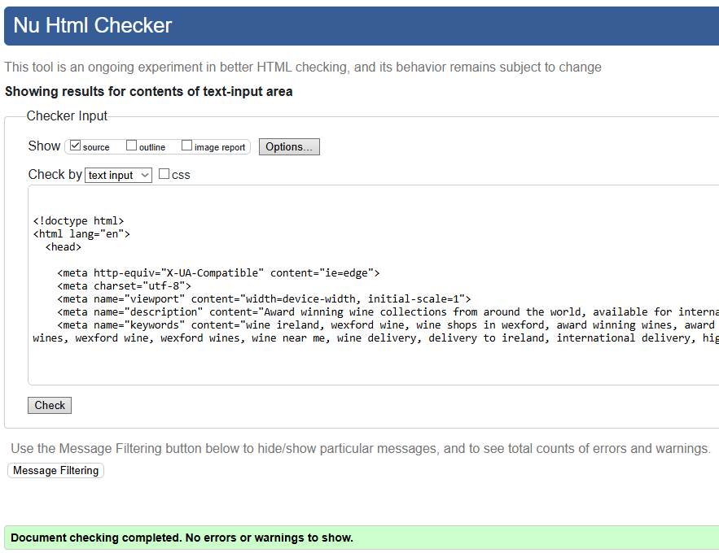 | |
| wine | [edit_listing.html](https://github.com/Nic-Wallace/wexford-wines/blob/main/wine/templates/wine/edit_listing.html) | |  | |
| wine | [wine.html](https://github.com/Nic-Wallace/wexford-wines/blob/main/wine/templates/wine/wine.html) | [Link](https://validator.w3.org/nu/?doc=https%3A%2F%2Fwexford-wines-e7893e8780a4.herokuapp.com%2Fwines%2F) |  | JS type warning |
| wine | [wine_listing.html](https://github.com/Nic-Wallace/wexford-wines/blob/main/wine/templates/wine/wine_listing.html) | [Link](https://validator.w3.org/nu/?doc=https%3A%2F%2Fwexford-wines-e7893e8780a4.herokuapp.com%2Fwines%2F7%2F) |  |  |

### CSS

I have used the recommended [CSS Jigsaw Validator](https://jigsaw.w3.org/css-validator) to validate all of my CSS files.

| Directory | File | URL | Screenshot | Notes |
| --- | --- | --- | --- | --- |
| checkout | [checkout.css](https://github.com/Nic-Wallace/wexford-wines/blob/main/checkout/static/checkout/css/checkout.css) | | 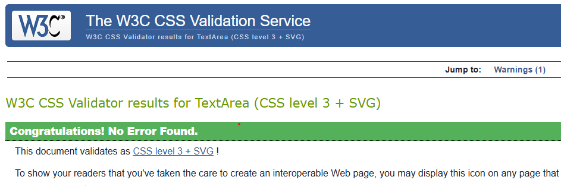 | |
| profiles | [profile.css](https://github.com/Nic-Wallace/wexford-wines/blob/main/profiles/static/profiles/css/profile.css) | |  | |
| static | [base.css](https://github.com/Nic-Wallace/wexford-wines/blob/main/static/css/base.css) | [Link](https://jigsaw.w3.org/css-validator/validator?uri=https%3A%2F%2Fwexford-wines-e7893e8780a4.herokuapp.com&profile=css3svg&usermedium=all&warning=1&vextwarning=&lang=en) |  | |

### JavaScript

I have used the recommended [JShint Validator](https://jshint.com) to validate all of my JS files.

| Directory | File | URL | Screenshot | Notes |
| --- | --- | --- | --- | --- |
| checkout | [stripe_elements.js](https://github.com/Nic-Wallace/wexford-wines/blob/main/checkout/static/checkout/js/stripe_elements.js) | N/A |  |  |
| profiles | [countryfield.js](https://github.com/Nic-Wallace/wexford-wines/blob/main/profiles/static/profiles/js/countryfield.js) | N/A |  |  |

### Python
I have used the recommended [PEP8 CI Python Linter](https://pep8ci.herokuapp.com) to validate all of my Python files.

| Directory | File | URL | Screenshot | Notes |
| --- | --- | --- | --- | --- |
| cart | [admin.py](https://github.com/Nic-Wallace/wexford-wines/blob/main/cart/admin.py) | [PEP8 CI Link](https://pep8ci.herokuapp.com/https://raw.githubusercontent.com/Nic-Wallace/wexford-wines/main/cart/admin.py) |  | |
| cart | [contexts.py](https://github.com/Nic-Wallace/wexford-wines/blob/main/cart/contexts.py) | [PEP8 CI Link](https://pep8ci.herokuapp.com/https://raw.githubusercontent.com/Nic-Wallace/wexford-wines/main/cart/contexts.py) |  | |
| cart | [models.py](https://github.com/Nic-Wallace/wexford-wines/blob/main/cart/models.py) | [PEP8 CI Link](https://pep8ci.herokuapp.com/https://raw.githubusercontent.com/Nic-Wallace/wexford-wines/main/cart/models.py) |  | |
| cart | [cart_tools.py](https://github.com/Nic-Wallace/wexford-wines/blob/main/cart/templatetags/cart_tools.py) | [PEP8 CI Link](https://pep8ci.herokuapp.com/https://raw.githubusercontent.com/Nic-Wallace/wexford-wines/main/cart/templatetags/cart_tools.py) |  | |
| cart | [tests.py](https://github.com/Nic-Wallace/wexford-wines/blob/main/cart/tests.py) | [PEP8 CI Link](https://pep8ci.herokuapp.com/https://raw.githubusercontent.com/Nic-Wallace/wexford-wines/main/cart/tests.py) |  | |
| cart | [urls.py](https://github.com/Nic-Wallace/wexford-wines/blob/main/cart/urls.py) | [PEP8 CI Link](https://pep8ci.herokuapp.com/https://raw.githubusercontent.com/Nic-Wallace/wexford-wines/main/cart/urls.py) |  | |
| cart | [views.py](https://github.com/Nic-Wallace/wexford-wines/blob/main/cart/views.py) | [PEP8 CI Link](https://pep8ci.herokuapp.com/https://raw.githubusercontent.com/Nic-Wallace/wexford-wines/main/cart/views.py) |  | |
| checkout | [admin.py](https://github.com/Nic-Wallace/wexford-wines/blob/main/checkout/admin.py) | [PEP8 CI Link](https://pep8ci.herokuapp.com/https://raw.githubusercontent.com/Nic-Wallace/wexford-wines/main/checkout/admin.py) |  | |
| checkout | [forms.py](https://github.com/Nic-Wallace/wexford-wines/blob/main/checkout/forms.py) | [PEP8 CI Link](https://pep8ci.herokuapp.com/https://raw.githubusercontent.com/Nic-Wallace/wexford-wines/main/checkout/forms.py) |  | |
| checkout | [models.py](https://github.com/Nic-Wallace/wexford-wines/blob/main/checkout/models.py) | [PEP8 CI Link](https://pep8ci.herokuapp.com/https://raw.githubusercontent.com/Nic-Wallace/wexford-wines/main/checkout/models.py) |  | |
| checkout | [signals.py](https://github.com/Nic-Wallace/wexford-wines/blob/main/checkout/signals.py) | [PEP8 CI Link](https://pep8ci.herokuapp.com/https://raw.githubusercontent.com/Nic-Wallace/wexford-wines/main/checkout/signals.py) |  | |
| checkout | [tests.py](https://github.com/Nic-Wallace/wexford-wines/blob/main/checkout/tests.py) | [PEP8 CI Link](https://pep8ci.herokuapp.com/https://raw.githubusercontent.com/Nic-Wallace/wexford-wines/main/checkout/tests.py) |  | |
| checkout | [urls.py](https://github.com/Nic-Wallace/wexford-wines/blob/main/checkout/urls.py) | [PEP8 CI Link](https://pep8ci.herokuapp.com/https://raw.githubusercontent.com/Nic-Wallace/wexford-wines/main/checkout/urls.py) | 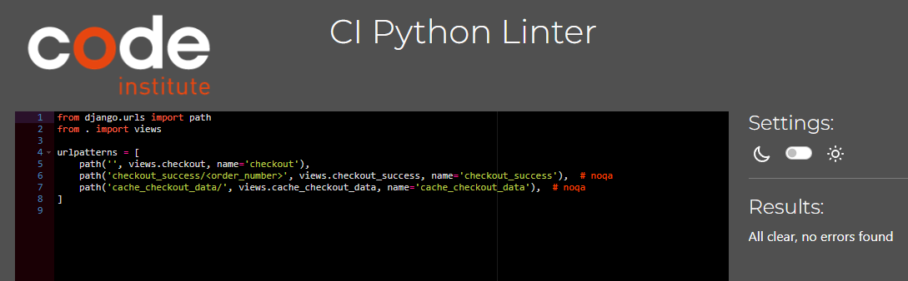 | |
| checkout | [views.py](https://github.com/Nic-Wallace/wexford-wines/blob/main/checkout/views.py) | [PEP8 CI Link](https://pep8ci.herokuapp.com/https://raw.githubusercontent.com/Nic-Wallace/wexford-wines/main/checkout/views.py) |  | |
| contact | [admin.py](https://github.com/Nic-Wallace/wexford-wines/blob/main/contact/admin.py) | [PEP8 CI Link](https://pep8ci.herokuapp.com/https://raw.githubusercontent.com/Nic-Wallace/wexford-wines/main/contact/admin.py) |  | |
| contact | [forms.py](https://github.com/Nic-Wallace/wexford-wines/blob/main/contact/forms.py) | [PEP8 CI Link](https://pep8ci.herokuapp.com/https://raw.githubusercontent.com/Nic-Wallace/wexford-wines/main/contact/forms.py) |  | |
| contact | [models.py](https://github.com/Nic-Wallace/wexford-wines/blob/main/contact/models.py) | [PEP8 CI Link](https://pep8ci.herokuapp.com/https://raw.githubusercontent.com/Nic-Wallace/wexford-wines/main/contact/models.py) |  | |
| contact | [urls.py](https://github.com/Nic-Wallace/wexford-wines/blob/main/contact/urls.py) | [PEP8 CI Link](https://pep8ci.herokuapp.com/https://raw.githubusercontent.com/Nic-Wallace/wexford-wines/main/contact/urls.py) |  | |
| contact | [views.py](https://github.com/Nic-Wallace/wexford-wines/blob/main/contact/views.py) | [PEP8 CI Link](https://pep8ci.herokuapp.com/https://raw.githubusercontent.com/Nic-Wallace/wexford-wines/main/contact/views.py) |  | |
| faqs | [admin.py](https://github.com/Nic-Wallace/wexford-wines/blob/main/faqs/admin.py) | [PEP8 CI Link](https://pep8ci.herokuapp.com/https://raw.githubusercontent.com/Nic-Wallace/wexford-wines/main/faqs/admin.py) |  | |
| faqs | [forms.py](https://github.com/Nic-Wallace/wexford-wines/blob/main/faqs/forms.py) | [PEP8 CI Link](https://pep8ci.herokuapp.com/https://raw.githubusercontent.com/Nic-Wallace/wexford-wines/main/faqs/forms.py) |  | |
| faqs | [models.py](https://github.com/Nic-Wallace/wexford-wines/blob/main/faqs/models.py) | [PEP8 CI Link](https://pep8ci.herokuapp.com/https://raw.githubusercontent.com/Nic-Wallace/wexford-wines/main/faqs/models.py) |  | |
| faqs | [urls.py](https://github.com/Nic-Wallace/wexford-wines/blob/main/faqs/urls.py) | [PEP8 CI Link](https://pep8ci.herokuapp.com/https://raw.githubusercontent.com/Nic-Wallace/wexford-wines/main/faqs/urls.py) |  | |
| faqs | [views.py](https://github.com/Nic-Wallace/wexford-wines/blob/main/faqs/views.py) | [PEP8 CI Link](https://pep8ci.herokuapp.com/https://raw.githubusercontent.com/Nic-Wallace/wexford-wines/main/faqs/views.py) |  | |
| homepage | [admin.py](https://github.com/Nic-Wallace/wexford-wines/blob/main/homepage/admin.py) | [PEP8 CI Link](https://pep8ci.herokuapp.com/https://raw.githubusercontent.com/Nic-Wallace/wexford-wines/main/homepage/admin.py) |  | |
| homepage | [models.py](https://github.com/Nic-Wallace/wexford-wines/blob/main/homepage/models.py) | [PEP8 CI Link](https://pep8ci.herokuapp.com/https://raw.githubusercontent.com/Nic-Wallace/wexford-wines/main/homepage/models.py) | 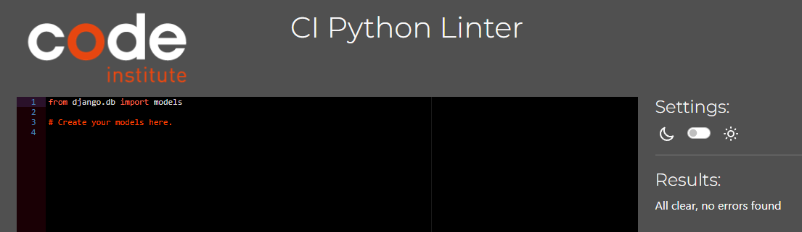 | |
| homepage | [tests.py](https://github.com/Nic-Wallace/wexford-wines/blob/main/homepage/tests.py) | [PEP8 CI Link](https://pep8ci.herokuapp.com/https://raw.githubusercontent.com/Nic-Wallace/wexford-wines/main/homepage/tests.py) |  | |
| homepage | [urls.py](https://github.com/Nic-Wallace/wexford-wines/blob/main/homepage/urls.py) | [PEP8 CI Link](https://pep8ci.herokuapp.com/https://raw.githubusercontent.com/Nic-Wallace/wexford-wines/main/homepage/urls.py) |  | |
| homepage | [views.py](https://github.com/Nic-Wallace/wexford-wines/blob/main/homepage/views.py) | [PEP8 CI Link](https://pep8ci.herokuapp.com/https://raw.githubusercontent.com/Nic-Wallace/wexford-wines/main/homepage/views.py) | 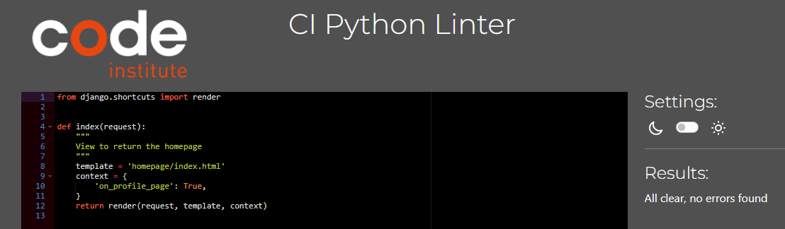 | |
|  | [manage.py](https://github.com/Nic-Wallace/wexford-wines/blob/main/manage.py) | [PEP8 CI Link](https://pep8ci.herokuapp.com/https://raw.githubusercontent.com/Nic-Wallace/wexford-wines/main/manage.py) |  | |
| newsletter | [admin.py](https://github.com/Nic-Wallace/wexford-wines/blob/main/newsletter/admin.py) | [PEP8 CI Link](https://pep8ci.herokuapp.com/https://raw.githubusercontent.com/Nic-Wallace/wexford-wines/main/newsletter/admin.py) |  | |
| newsletter | [forms.py](https://github.com/Nic-Wallace/wexford-wines/blob/main/newsletter/forms.py) | [PEP8 CI Link](https://pep8ci.herokuapp.com/https://raw.githubusercontent.com/Nic-Wallace/wexford-wines/main/newsletter/forms.py) |  | |
| newsletter | [models.py](https://github.com/Nic-Wallace/wexford-wines/blob/main/newsletter/models.py) | [PEP8 CI Link](https://pep8ci.herokuapp.com/https://raw.githubusercontent.com/Nic-Wallace/wexford-wines/main/newsletter/models.py) |  | |
| newsletter | [urls.py](https://github.com/Nic-Wallace/wexford-wines/blob/main/newsletter/urls.py) | [PEP8 CI Link](https://pep8ci.herokuapp.com/https://raw.githubusercontent.com/Nic-Wallace/wexford-wines/main/newsletter/urls.py) |  | |
| newsletter | [views.py](https://github.com/Nic-Wallace/wexford-wines/blob/main/newsletter/views.py) | [PEP8 CI Link](https://pep8ci.herokuapp.com/https://raw.githubusercontent.com/Nic-Wallace/wexford-wines/main/newsletter/views.py) |  | |
| profiles | [admin.py](https://github.com/Nic-Wallace/wexford-wines/blob/main/profiles/admin.py) | [PEP8 CI Link](https://pep8ci.herokuapp.com/https://raw.githubusercontent.com/Nic-Wallace/wexford-wines/main/profiles/admin.py) |  | |
| profiles | [forms.py](https://github.com/Nic-Wallace/wexford-wines/blob/main/profiles/forms.py) | [PEP8 CI Link](https://pep8ci.herokuapp.com/https://raw.githubusercontent.com/Nic-Wallace/wexford-wines/main/profiles/forms.py) |  | |
| profiles | [models.py](https://github.com/Nic-Wallace/wexford-wines/blob/main/profiles/models.py) | [PEP8 CI Link](https://pep8ci.herokuapp.com/https://raw.githubusercontent.com/Nic-Wallace/wexford-wines/main/profiles/models.py) |  | |
| profiles | [tests.py](https://github.com/Nic-Wallace/wexford-wines/blob/main/profiles/tests.py) | [PEP8 CI Link](https://pep8ci.herokuapp.com/https://raw.githubusercontent.com/Nic-Wallace/wexford-wines/main/profiles/tests.py) |  | |
| profiles | [urls.py](https://github.com/Nic-Wallace/wexford-wines/blob/main/profiles/urls.py) | [PEP8 CI Link](https://pep8ci.herokuapp.com/https://raw.githubusercontent.com/Nic-Wallace/wexford-wines/main/profiles/urls.py) |  | |
| profiles | [views.py](https://github.com/Nic-Wallace/wexford-wines/blob/main/profiles/views.py) | [PEP8 CI Link](https://pep8ci.herokuapp.com/https://raw.githubusercontent.com/Nic-Wallace/wexford-wines/main/profiles/views.py) |  | |
| wexford_wines | [settings.py](https://github.com/Nic-Wallace/wexford-wines/blob/main/wexford_wines/settings.py) | [PEP8 CI Link](https://pep8ci.herokuapp.com/https://raw.githubusercontent.com/Nic-Wallace/wexford-wines/main/wexford_wines/settings.py) |  | |
| wexford_wines | [urls.py](https://github.com/Nic-Wallace/wexford-wines/blob/main/wexford_wines/urls.py) | [PEP8 CI Link](https://pep8ci.herokuapp.com/https://raw.githubusercontent.com/Nic-Wallace/wexford-wines/main/wexford_wines/urls.py) |  | |
| wexford_wines | [views.py](https://github.com/Nic-Wallace/wexford-wines/blob/main/wexford_wines/views.py) | [PEP8 CI Link](https://pep8ci.herokuapp.com/https://raw.githubusercontent.com/Nic-Wallace/wexford-wines/main/wexford_wines/views.py) |  | |
| wine | [admin.py](https://github.com/Nic-Wallace/wexford-wines/blob/main/wine/admin.py) | [PEP8 CI Link](https://pep8ci.herokuapp.com/https://raw.githubusercontent.com/Nic-Wallace/wexford-wines/main/wine/admin.py) |  | |
| wine | [forms.py](https://github.com/Nic-Wallace/wexford-wines/blob/main/wine/forms.py) | [PEP8 CI Link](https://pep8ci.herokuapp.com/https://raw.githubusercontent.com/Nic-Wallace/wexford-wines/main/wine/forms.py) |  | |
| wine | [models.py](https://github.com/Nic-Wallace/wexford-wines/blob/main/wine/models.py) | [PEP8 CI Link](https://pep8ci.herokuapp.com/https://raw.githubusercontent.com/Nic-Wallace/wexford-wines/main/wine/models.py) |  | |
| wine | [tests.py](https://github.com/Nic-Wallace/wexford-wines/blob/main/wine/tests.py) | [PEP8 CI Link](https://pep8ci.herokuapp.com/https://raw.githubusercontent.com/Nic-Wallace/wexford-wines/main/wine/tests.py) |  | |
| wine | [urls.py](https://github.com/Nic-Wallace/wexford-wines/blob/main/wine/urls.py) | [PEP8 CI Link](https://pep8ci.herokuapp.com/https://raw.githubusercontent.com/Nic-Wallace/wexford-wines/main/wine/urls.py) |  | |
| wine | [views.py](https://github.com/Nic-Wallace/wexford-wines/blob/main/wine/views.py) | [PEP8 CI Link](https://pep8ci.herokuapp.com/https://raw.githubusercontent.com/Nic-Wallace/wexford-wines/main/wine/views.py) |  | |

 
## Responsiveness

I've tested my deployed project to check for responsiveness issues. I used my mobile phone Xiaomi RedMi Note 10Pro, my tablet Samsung Galaxy Tab A and my desktop monitor for these, and experienced no issues.

| Page | Mobile | Tablet | Desktop | Notes |
| --- | --- | --- | --- | --- |
| Register |  |  |  | Works as expected |
| Login |  |  |  | Works as expected |
| Profile |  |  |  | Works as expected |
| Homepage |  |  |  | Works as expected |
| Wines |  |  |  | Works as expected |
| Wine Details |  |  |  | Works as expected |
| Cart |  |  |  | Works as expected |
| Checkout |  |  |  | Works as expected |
| Checkout Success |  |  |  | Works as expected |
| Add Listing |  |  |  | Works as expected |
| Edit Listing |  |  |  | Works as expected |
| Newsletter |  |  |  | Works as expected |
| Contact |  |  |  | Works as expected |
| 404 |  |  |  | Works as expected |

## Browser Compatibility
I've tested my deployed project on multiple browsers to check for compatibility issues. I have used Chrome, Firefox and Opera, and have found no issues.

| Page | Chrome | Firefox | Opera | Notes |
| --- | --- | --- | --- | --- |
| Register |  |  |  | Works as expected |
| Login |  |  |  | Works as expected |
| Profile |  |  |  | Works as expected |
| Homepage |  |  |  | Works as expected |
| Wines |  |  |  | Works as expected |
| Wine Details |  | 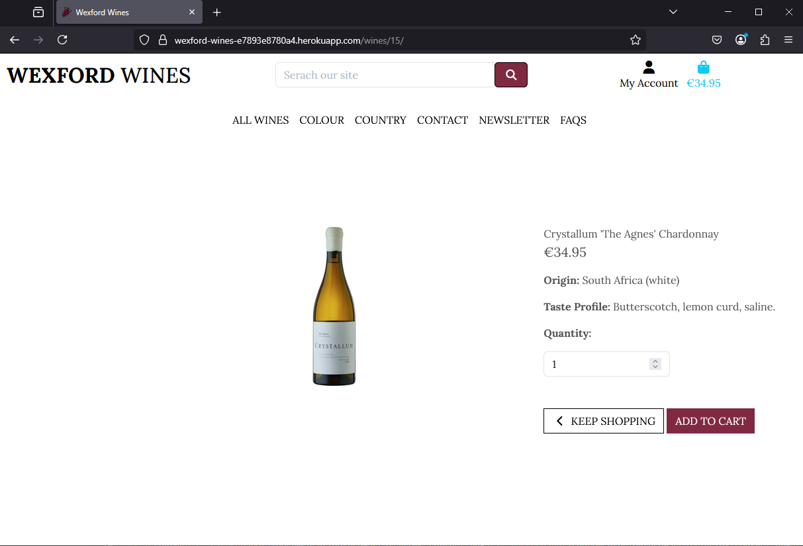 |  | Works as expected |
| Cart |  |  |  | Works as expected |
| Checkout |  |  |  | Works as expected |
| Checkout Success |  |  |  | Works as expected |
| Add Listing |  |  |  | Works as expected |
| Edit Listing |  |  |  | Works as expected |
| Newsletter |  |  |  | Works as expected |
| Contact |  |  |  | Works as expected |
| 404 |  |  |  | Works as expected |

## Lighthouse Audit
I've tested my deployed project using the Lighthouse Audit tool to check for any major issues. Some warnings are outside of my control, and mobile results tend to be lower than desktop.

| Page | Mobile | Desktop |
| --- | --- | --- |
| Register |  |  |
| Login |  |  |
| Profile |  |  |
| Homepage | 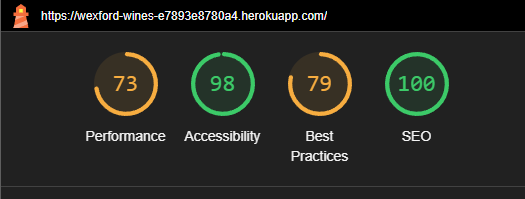 |  |
| Wines | 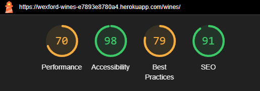 |  |
| Wine Details |  |  |
| Cart | 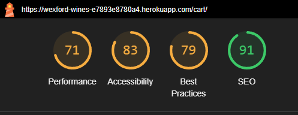 |  |
| Checkout |  |  |
| Checkout Success |  |  |
| Add Listing |  | 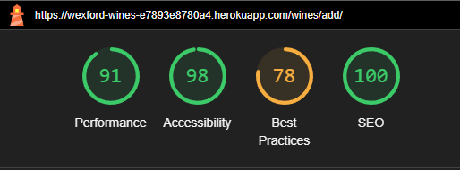 |
| Edit Listing |  |  |
| Newsletter |  |  |
| Contact |  |  |
| 404 |  |  |

## Defensive Programming

Defensive programming was manually tested with the below user acceptance testing:

| Page | Expectation | Test | Result | Screenshot |
| --- | --- | --- | --- | --- |
| Wines | Feature is expected to allow users to browse wines without registration. | Opened wine pages as a guest user. | Wines were fully accessible without requiring registration. |  |
| | Feature is expected to filter wines by country. | Applied country(alphabetically) filter while browsing wines. | Filter worked as expected. |  |
| | Feature is expected to filter wines by colour. | Applied colour filter while browsing wines. | Filter worked as expected. |  |
| | Feature is expected to show detailed wine information. | Clicked on individual wines to view details. | Wine details (taste-profile, price, image, country, colour) were displayed correctly. |  |
| Shopping Cart | Feature is expected to allow customers to add items to the cart with quantity controls. | Added wines to the cart and adjusted quantities. | Items were added successfully, and quantities updated as expected. |  |
| | Feature is expected to allow customers to view and manage their cart. | Opened the cart page and edited cart contents. | Cart contents were displayed, updated, and removed correctly. |  |
| Checkout | Feature is expected to display cart items, grand total, and input fields for checkout. | Proceeded to checkout with items in the cart. | Checkout page displayed cart items, total, and input fields as expected. |  |
| | Feature is expected to allow secure payment via Stripe. | Entered valid card details using Stripe at checkout. | Payment was processed securely, and an order confirmation page was displayed. |  |
| | Feature is expected to send a confirmation email after purchase. | Completed a purchase and checked email inbox. | Confirmation email was received with order details. |  |
| | Feature is expected to display an order confirmation page with an order number. | Completed a purchase. | Order confirmation page displayed successfully with an order number. |  |
| Account Management | Feature is expected to allow returning customers to log in and view past orders. | Logged in as a returning customer and accessed order history. | Past orders were displayed correctly in the account section. |  |
| | Feature is expected to remember the shipping address for returning customers. | Completed multiple checkouts as a returning customer. | Shipping address was pre-filled on subsequent purchases. |  |
| Admin Features | Feature is expected to allow the site owner to create new wines. | Created new wines with valid data (name, price, taste-profile, image, colour, country). | wines were added successfully and displayed on the site. |  |
| | Feature is expected to allow the site owner to update wine details. | Edited product details as an admin user. | Wine updates were saved and displayed correctly. |  |
| | Feature is expected to allow the site owner to delete wines. | Deleted a wine from the inventory. | Wine was removed successfully from the site. |  |
| | Feature is expected to allow the site owner to manage the FAQs. | Added an FAQ question and answer. | FAQ was successfully added to the site. |  |
| Orders | Feature is expected to allow the site owner to view all orders placed. | Accessed the orders dashboard as an admin user. | All orders were displayed correctly. |  |
| Profile | Feature is expected to allow the registered site user to view profile details and order history. | Accessed the profile as a registered user. | Profile details and orders were displayed correctly. |  |
| Newsletter | Feature is expected to allow users to sign up for the newsletter. | Submitted valid email addresses for newsletter registration. | Email addresses were successfully added to the newsletter list. |  |
| 404 Error Page | Feature is expected to display a 404 error page for non-existent pages. | Navigated to an invalid URL (e.g., `/invalid`). | A custom 404 error page was displayed as expected. |  |
| Contact | Feature is expected to allow users to fill out a form to contact the site owner. | Submitted valid form. | Notified in browser that the message had been sent. |  |
| FAQs | Feature is expected to allow users to view frequently asked questions. | Navigated to FAQ page and clicked dropdown box. | Successfully viewed questions and answers. |  |

## User Story Testing

| Target | Expectation | Outcome | Screenshot |
| --- | --- | --- | --- |
| As a site admin | I would like to add new wines | so that I can keep the site up to date with new products |  |
| As a site admin | I would like to view and edit wine listings | so that I can keep the site up to date |  |
| As a site admin | I would like to delete wine listings | so that I can keep the site up to date with what is available to buy |  |
| As a site admin | I would like to log in and complete authentication | so that I can access the admin tools and keep the site secure | 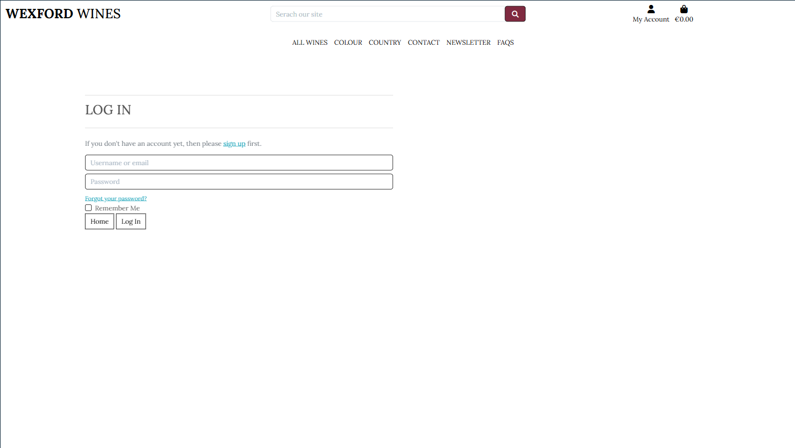 |
| As a site user | I would like to view and add products to cart | so that I can view and later purchase products in one go |  |
| As a site user | I would like to modify products in my cart | so that I can remove an item or update the amount of each item I want |  |
| As a site user | I would like to be informed of any actions I make | so that I know if my action was successful, which could not be completed and why |  |
| As a site user | I would like to view a product and its relevant information | so that I can find out more about the product |  |
| As a site user | I would like to view a list of all wines | so that I can know my options and select one to view |  |
| As a site user | I would like to login to the site | so that I can have my order history collected in one place to review |  |
| As a site user | I would like to login, logout, and delete my account | so that I can have control over my account |  |
| As a site user | I would like to sign up to a newsletter | so that I can be kept up to date with new wine products and events |  |
| As a site user | I would like to view an FAQ page | so that I can get fast answers to any questions I may have |  |
| As a site user | I would like to find and fill out a contact form with a message | so that I can communicate with the business |  |

### Fixed Bugs

I've tracked and managed bugs and issues during the development stages of my project by taking screenshots and saving any relevant sites I used in finding a solution. I kept track of the bugs in my notes app on my PC:

| Problem | Fix | Link/Screenshot |
| --- | --- | --- |
| Fix admin login error after creating userprofiles, missing userprofile | Foud fix for same issue from student on slack |  |
| Fix account dropdown visibility on desktop, works on mobile | Add up to date bootstrap 'data-bs-toggle' in place of 'data-toggle' | [Bootstrap Documentation](https://getbootstrap.com/docs/5.0/components/collapse/) |
| Fix renaming app issue | Used article found on slack to try rename, didnt work, used tutor support, removed the migration file recommended in the article and fixed the view rendering the correct template | [DjangoTricks](https://djangotricks.blogspot.com/2022/10/how-to-rename-a-django-app.html) |
| Fix commit error | Followed a YouTube video, entered rebase, reworded the commit and saved before pushing | [Change Git Commit Messages Tutorial](https://www.youtube.com/watch?v=gz26pPCK2x4&t=68s) |
| Fix main nav rosé button, all other colour links work properly to search, except the rosé option | Added if else query using Q in the views to allow both rose and rosé to be searched |  |
| Fix ability to search colour and country in serach bar | Fixed model element names in the wine admin file commit |  |
| Fix controls for items in cart (remove, update quantity, buttons) | Found that it had a JS block name difference, I amended the names. Problem spotted by my mentor | |

### Known Issues

| Issue | Screenshot |
| --- | --- |
| With a known order-number, users can brute-force "checkout_success.html" and see potentially sensitive information. |  |
| If a product is in your bag/cart, but then gets deleted from the database, it throws errors from the session storage memory. |  |

> [!IMPORTANT]
> There are no remaining bugs that I am aware of, though, even after thorough testing, I cannot rule out the possibility.